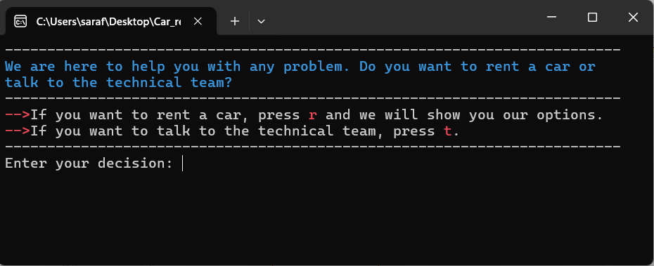
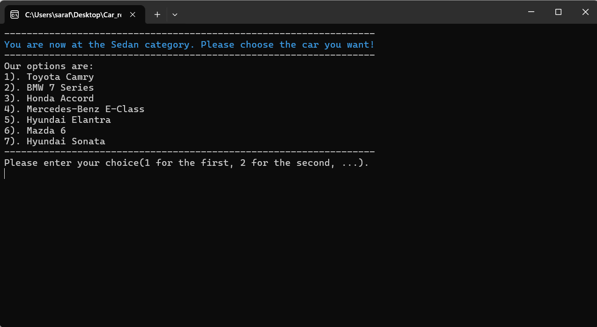
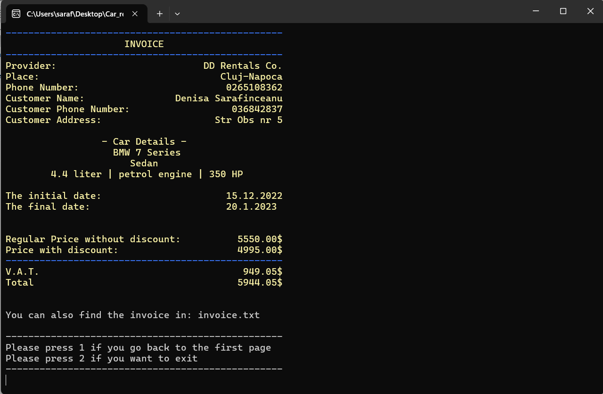
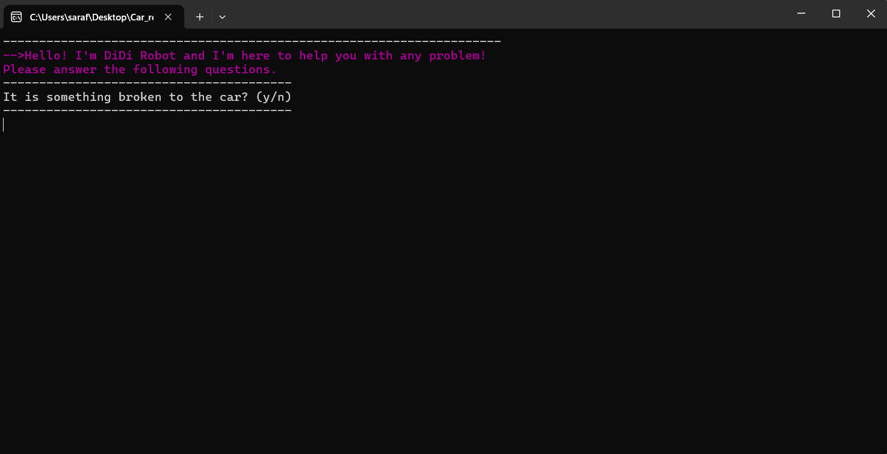

# Car-rental-management

## Project Overview
This project implements a **Car Rental and Support System** that provides two main functionalities:
 1. **Car Rental Service**: Allows users to rent cars by selecting from available options.
 2. **Technical Support**: Provides a chat-like interface to resolve issues or address questions about the rented vehicles.

## Core Functionalities:
 - Car Rental:
     - Users can view available cars and choose one for rental.
     - Rental details are managed efficiently.
 - Technical Support:
     - Users can interact with a virtual support system to address issues.
     - A guided menu helps users resolve common problems or pay for damages.
  
## Results
### Start page

### Rent a car

### Select a car

### Registration

### Invoice - that will also generate an invoice.txt

### Technical support

Thank you! ✨
